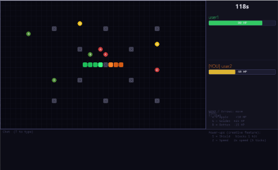
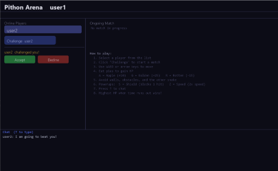
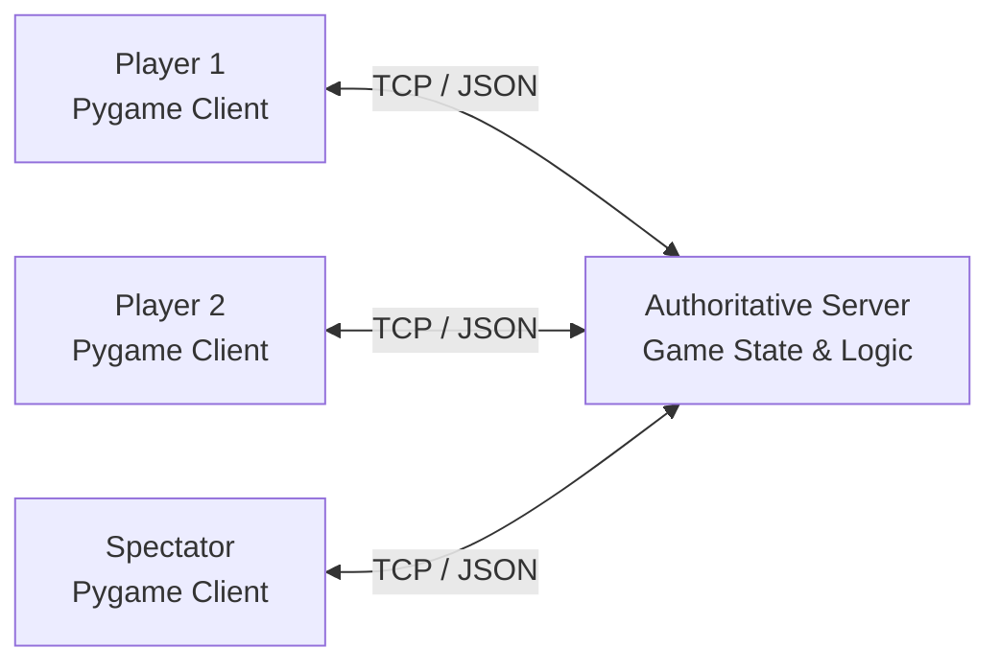

# Πthon Arena

A real-time multiplayer Snake battle game built with **Python**, **Pygame**, and **TCP sockets** using a server-authoritative client-server architecture.

Πthon Arena supports two players competing over a network while additional clients can join as live spectators. The server manages the authoritative game state, collision logic, matchmaking, and state synchronization, while clients handle user input and rendering.
## Demo



### Multiplayer Lobby



## Highlights

- Real-time two-player gameplay over persistent TCP connections
- Server-authoritative game state synchronized at 10 Hz
- Custom newline-delimited JSON messaging protocol
- Concurrent client handling using Python threading
- Lobby, username validation, and player challenge system
- Live spectator mode with mid-game joining
- In-game and lobby text chat
- Health-based collision and combat mechanics
- Collectibles, obstacles, and temporary power-ups
- Pygame graphical interface with game, lobby, and results screens

## Architecture



The application follows a thin-client architecture:

- **Server:** owns game state, movement, collision detection, matchmaking, pickups, and win conditions.
- **Clients:** capture keyboard input, receive state updates, and render the game using Pygame.
- **Networking:** persistent TCP connections using newline-delimited JSON messages.
- **Concurrency:** connected clients are handled concurrently, while shared server state is synchronized between threads.

## Getting Started

### Requirements

- Python 3
- Pygame 2.1+

The project has been tested locally with **Python 3.12**.

Install the dependency:

```bash
python -m pip install -r requirements.txt
```

### Start the Server

```bash
python server.py
```

The default server listens on port `5555`.

To use another port:

```bash
python server.py 9000
```

### Start the Clients

Open separate terminals for each player:

```bash
python client.py
```

By default, clients connect to:

```text
127.0.0.1:5555
```

A remote address and port can also be supplied:

```bash
python client.py 192.168.1.10 5555
```

Two clients can challenge each other and start a match. Additional connected clients can spectate an active game.

## Controls

| Key | Action |
| --- | --- |
| `W` / `↑` | Move up |
| `S` / `↓` | Move down |
| `A` / `←` | Move left |
| `D` / `→` | Move right |
| `T` | Open chat |
| `Enter` | Send message |
| `Esc` | Cancel chat input |

## Gameplay

Matches take place on a **40 × 25 grid** and last up to **120 seconds**.

Each player begins with 100 HP. Instead of immediately ending the game, collisions reduce health depending on the type of collision. Players can recover or lose additional health by collecting different types of pies.

The game includes:

- Wall, obstacle, snake-body, self, and head-to-head collisions
- Apple, golden, and rotten pies with different health effects
- Symmetrically positioned static obstacles
- Health bars and match timer
- Shield and speed-boost power-ups
- HP-based and timer-based win conditions

## Networking & Protocol

Communication uses **newline-delimited JSON over TCP**. Each JSON object represents one complete application-level message.

Example client input:

```json
{
  "type": "input",
  "direction": "UP"
}
```

Example chat message:

```json
{
  "type": "chat",
  "message": "hello"
}
```

The server sends complete game-state snapshots to players and spectators at a fixed tick rate rather than sending incremental state differences.

This keeps synchronization simple and allows a spectator joining during an active match to immediately receive the current state.

### Main Client → Server Messages

- `join`
- `challenge`
- `accept_challenge`
- `decline_challenge`
- `input`
- `chat`
- `spectate`
- `leave_game`

### Main Server → Client Messages

- `join_ok`
- `join_error`
- `lobby`
- `challenge_received`
- `game_start`
- `spectate_ok`
- `game_state`
- `game_end`
- `chat`

## Project Structure

```text
pithon-arena/
├── client.py          # Pygame client, rendering, input, and networking
├── server.py          # Authoritative server and game logic
├── requirements.txt   # Python dependencies
├── README.md
└── .gitignore
```

Additional demo assets and automated tests will be added to the portfolio version of the project.

## Project Background

Πthon Arena was originally developed collaboratively as a final project for **EECE 350 — Computing Networks** at the **American University of Beirut**.

The project was designed to apply networking concepts through a complete interactive application, including socket programming, application-layer protocol design, concurrent connection handling, and real-time state synchronization.

## Possible Future Improvements

- Support multiple simultaneous matches
- Add persistent player statistics or leaderboards
- Improve latency handling for remote networks
- Explore UDP-based game-state updates
- Expand automated testing of server-side game logic